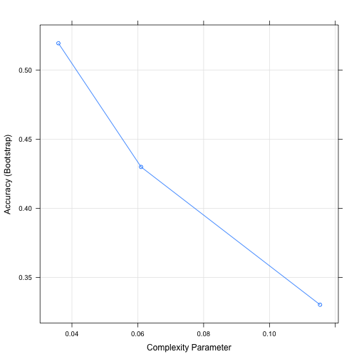
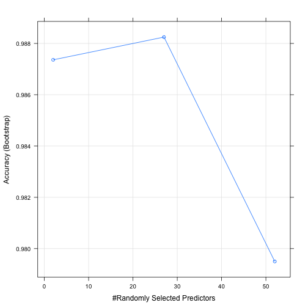

Human Activity Recognition Analysis
========================================================

In this analysis we model the Weight Lifting Exercise dataset in the Human Activity Recognition project.


```r
#Load the data set
library(caret);library(rattle);set.seed(123)
df <- read.csv("pml-training.csv", na.strings = c(NA, "NA", "#DIV/0!", '""'))
```

This dataset contains many NA values. We remove columns where more than 50% of the values are NA. We also remove from the dataset columns that will not be used in the modeling, such as timestamp and the names of subjects.


```r
df.na <- is.na(df); df.na <- data.frame(df.na); cm <- colMeans(df.na) #Calculate NA percentage for each colume
df.use <- df[,cm<=0.5]  #Keep only columns with less than half NAs
df.use <- df.use[,8:60] #Remove columns not used in modeling
```

Create training and testing sets.

```r
train <- createDataPartition(y=df.use$classe, p=0.75, list=FALSE)
training <- df.use[train,]
testing <- df.use[-train,]
```

Proprocess the data by imputing the remaining NA values with knn.

```r
preProc <- preProcess(training[,-53], method = c("knnImpute"))
trainingPP <- predict(preProc,training[,-53])
testingPP <- predict(preProc,testing[,-53])
```

We will fit two models on the training set and compare their predictive powers on the testing set. The first is a decision tree model, the second is a random forest model. For the latter we limit the number of trees to 50 to reduce computation time. 

```r
fit1 <- train(training$classe~., data=trainingPP, method = "rpart")  #Decision tree model
fit2 <- train(training$classe~., data = trainingPP, method="rf", ntree=50) #Random forest model
```

Both models are selected among their classes by cross validation. 
  

Now we will evaluate their respective predictive powers on the testing set.

```r
confusionMatrix(testing$classe, predict(fit1, testingPP))
```

```
## Confusion Matrix and Statistics
## 
##           Reference
## Prediction    A    B    C    D    E
##          A 1262   20  107    0    6
##          B  378  312  259    0    0
##          C  418   26  411    0    0
##          D  356  141  307    0    0
##          E  144  101  248    0  408
## 
## Overall Statistics
##                                           
##                Accuracy : 0.488           
##                  95% CI : (0.4739, 0.5021)
##     No Information Rate : 0.5216          
##     P-Value [Acc > NIR] : 1               
##                                           
##                   Kappa : 0.3307          
##  Mcnemar's Test P-Value : NA              
## 
## Statistics by Class:
## 
##                      Class: A Class: B Class: C Class: D Class: E
## Sensitivity            0.4934  0.52000  0.30856       NA  0.98551
## Specificity            0.9433  0.85200  0.87570   0.8361  0.89020
## Pos Pred Value         0.9047  0.32877  0.48070       NA  0.45283
## Neg Pred Value         0.6307  0.92718  0.77254       NA  0.99850
## Prevalence             0.5216  0.12235  0.27162   0.0000  0.08442
## Detection Rate         0.2573  0.06362  0.08381   0.0000  0.08320
## Detection Prevalence   0.2845  0.19352  0.17435   0.1639  0.18373
## Balanced Accuracy      0.7183  0.68600  0.59213       NA  0.93785
```

```r
confusionMatrix(testing$classe, predict(fit2, testingPP))
```

```
## Confusion Matrix and Statistics
## 
##           Reference
## Prediction    A    B    C    D    E
##          A 1394    1    0    0    0
##          B    4  942    1    1    1
##          C    0    6  845    4    0
##          D    0    0   10  793    1
##          E    0    0    0    0  901
## 
## Overall Statistics
##                                          
##                Accuracy : 0.9941         
##                  95% CI : (0.9915, 0.996)
##     No Information Rate : 0.2851         
##     P-Value [Acc > NIR] : < 2.2e-16      
##                                          
##                   Kappa : 0.9925         
##  Mcnemar's Test P-Value : NA             
## 
## Statistics by Class:
## 
##                      Class: A Class: B Class: C Class: D Class: E
## Sensitivity            0.9971   0.9926   0.9871   0.9937   0.9978
## Specificity            0.9997   0.9982   0.9975   0.9973   1.0000
## Pos Pred Value         0.9993   0.9926   0.9883   0.9863   1.0000
## Neg Pred Value         0.9989   0.9982   0.9973   0.9988   0.9995
## Prevalence             0.2851   0.1935   0.1746   0.1627   0.1841
## Detection Rate         0.2843   0.1921   0.1723   0.1617   0.1837
## Detection Prevalence   0.2845   0.1935   0.1743   0.1639   0.1837
## Balanced Accuracy      0.9984   0.9954   0.9923   0.9955   0.9989
```

The prediction accurary of the random forest model (0.99) is significantly higher than that of the decision tree model (0.49). We will therefore adopt the random forest model fit2. The estimated out-of-sample error rate is 0.0059.
